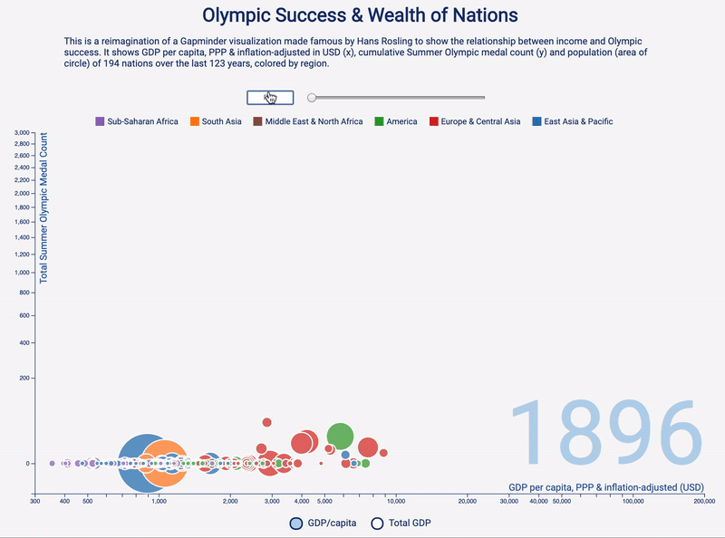

# Olympic Success & Wealth of Nations

Interactive bubble chart of relationship between Olympic success and GDP of nations since the start of the Modern Olympics. A reimagination of Gapminder's Wealth & Health of Nations.

[Live Link](https:// "Olympic Success")

# Architecture and Technologies
* HTML, CSS, JS, D3.js
* Data sourced from: Gapminder, Wikipedia

# Background
Data visualization on the relationship of GDP and Olympic success through an interactive bubble chart with the below dimensions:
* x-axis: GDP
* y-axis: total number of summer Olympic medals
* size of bubbles: population
* color: region
* the circles on the chart will adjust accordingly by year



# Technical Implementation
* Creating a tooltip with detailed information on population, GDP/capita and total summer Olympic medals with a couple of event handlers:
```javascript
//create tooltip div element
var tooltip = d3.select('#root')
            .append("div")
            .style("opacity", 0)
            .attr("class", "tooltip")

//tooltip mouseover event handler
var tipMouseover = function (d) {
    var html = d.name + "<br/>" + "pop: " + d3.format(",.2r")(d.population) + "<br/>" +
        "income: " + d3.format(",.2r")(d.income) + "<br/>" + "medals: " + d3.format(",.2r")(d.medals)

    tooltip.html(html)
        .style("left", (d3.event.pageX + 15) + "px")
        .style("top", (d3.event.pageY - 28) + "px")
        .transition()
        .duration(200)
        .style("opacity", .9)
};

// tooltip mouseout event handler
var tipMouseout = function (d) {
    tooltip.transition()
        .duration(300)
        .style("opacity", 0);
};
```

* Updating the circle position and size based on the slider value:
```javascript
//update circles based on input year
const update = (year) => {
            circle
                .data(getData(year), d => d.name)
                .sort((a, b) => d3.descending(a.population, b.population))
                .transition()
                .duration(500)
                .attr("cx", d => {
                    if (xVar === 'income') {
                        return (xScale(d[xVar]))
                    }
                    if (xVar === 'totalGDP') {
                        return (xScale2(d[xVar]))
                    }
                })
                .attr("cy", d => yAxis(d.medals))
                .attr("r", d => radius(d.population));
            yearLabel.text(year);
        }
```

* Starting auto-play on page load, adding event handlers to update circles based on slider position, and constructing play/pause button to control auto-play:
```javascript
const slider = d3.select("#year-slider")

//event handler on play slider to trigger update on circles
slider.on("mousemove", function () {
    update(this.value);
})

//increment year by one and update circles
const updateSlider = () => {
    let currentYear = slider.property("value")
    slider.property("value", parseInt(currentYear)+1);
    update(slider.property("value"));
}

//autoplay on load
let moveSlider = setInterval(updateSlider, 500);
const clearPlay = () => {clearInterval(moveSlider)};
//clear interval after 70 seconds
setTimeout(clearPlay, 70000)

const button = d3.select("button");

//stop auto-play on mousedown
slider.on("mousedown", () => {
    clearPlay();
    button.property("innerHTML","Play")
});

//update circles on click event handler
slider.on("click", () => {
    update(slider.property("value"));
});

//update button text and play when paused
button.on("click", () => {
    if (button.property("innerHTML") === "Play") {
        moveSlider = setInterval(updateSlider, 500);
        button.property("innerHTML", "Pause");
    } else {
        clearPlay();
        button.property("innerHTML", "Play");
    }
});
```

# Future Features
* On hover show a greyed out path for the country over the entire timeline of the chart
* Have a sidebar of checkboxes to filter the chart by categories (country, continent, sporting event, etc.)
* Add additional data points for x-axis and y-axis (winter olympic medals)